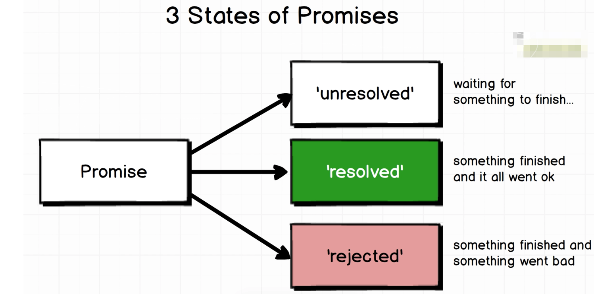

# javascript-promises

1. A **promise** is a javascript api that can maanage **asynchronous** code flow throughout an application. So a **promise** can handle any code that will execute in the future. 
2. There are 3 States of Promises 
    * **Unresolved** - Waiting for something to finish
    * **Resolved** - Something finished and it all went ok
    * **Rejected** - Something finished and it went bad